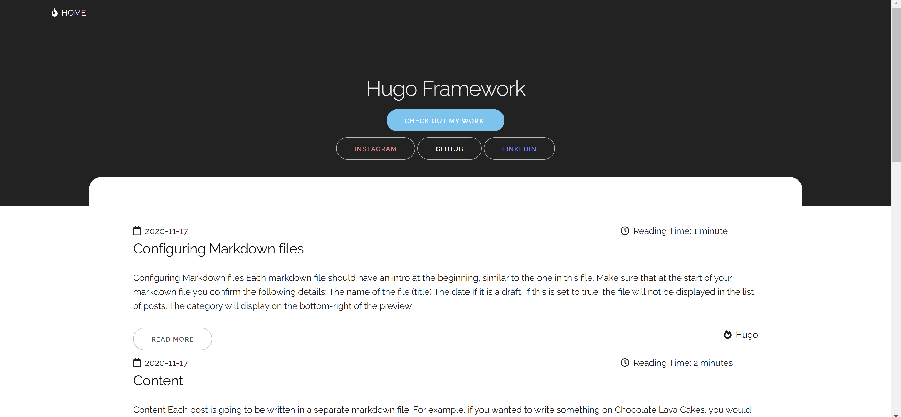

# hugo-framework

A simple site setup using the Hugo framework, running live at https://hugo-framework.netlify.app/.

It contains configurations and instructions on how to download a theme from https://themes.gohugo.io/.

